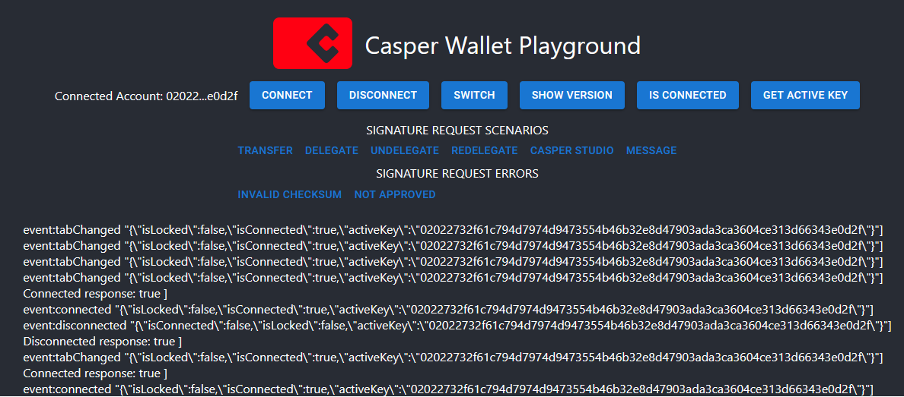

# Casper Wallet Playground App

## Introduction

Casper Wallet Playground App is a sample project designed to help developers understand how to integrate [Casper Wallet](https://github.com/make-software/casper-wallet) with third-party web applications. This repository serves as a reference implementation and learning resource for developers interested in the Casper Network ecosystem.

Please be aware that the app is only for development and testing, and not for direct usage in production environments, as the name suggests.

## Getting Started

To set up the development environment, follow these steps:

1. Prerequisites: Ensure you have [Node.js](https://nodejs.org/) and [npm](https://www.npmjs.com/) installed.
2. Clone the repository: `git clone https://github.com/make-software/casper-wallet-playground.git`
3. Navigate to the project directory: `cd casper-wallet-playground`
4. Install dependencies: `npm install`

Once the setup is complete, refer to the [Available Scripts](#available-scripts) section to start, test, or build the project.

## Available Scripts

In the project directory, you can run:

### `npm start`

Runs the app in the development mode.\
Open [http://localhost:3000](http://localhost:3000) to view it in the browser.

The page will reload if you make edits.\
You will also see any lint errors in the console.

### `npm test`

Launches the test runner in the interactive watch mode.\
See the section about [running tests](https://facebook.github.io/create-react-app/docs/running-tests) for more information.

### `npm run build`

Builds the app for production to the `build` folder.\
It correctly bundles React in production mode and optimizes the build for the best performance.

The build is minified and the filenames include the hashes.\
Your app is ready to be deployed!

See the section about [deployment](https://facebook.github.io/create-react-app/docs/deployment) for more information.

## Contributing

We welcome contributions from the community! If you'd like to contribute, please follow these guidelines:

1. Fork the repository and create a new branch for your feature or bug fix.
2. Commit your changes and submit a pull request to the original repository.
3. For issues, bug reports, or feature requests, please create a new issue in the [issue tracker](https://github.com/make-software/casper-wallet-playground/issues).

Before submitting a pull request, ensure you have:

- Followed the project's coding style and conventions.
- Added or updated relevant documentation.
- Included tests for new or updated functionality.

For more details on the contribution process, please refer to the [CONTRIBUTING.md](CONTRIBUTING.md) file.

## License

This project is licensed under the Apache License 2.0. For more information, see the [LICENSE](LICENSE) file.
